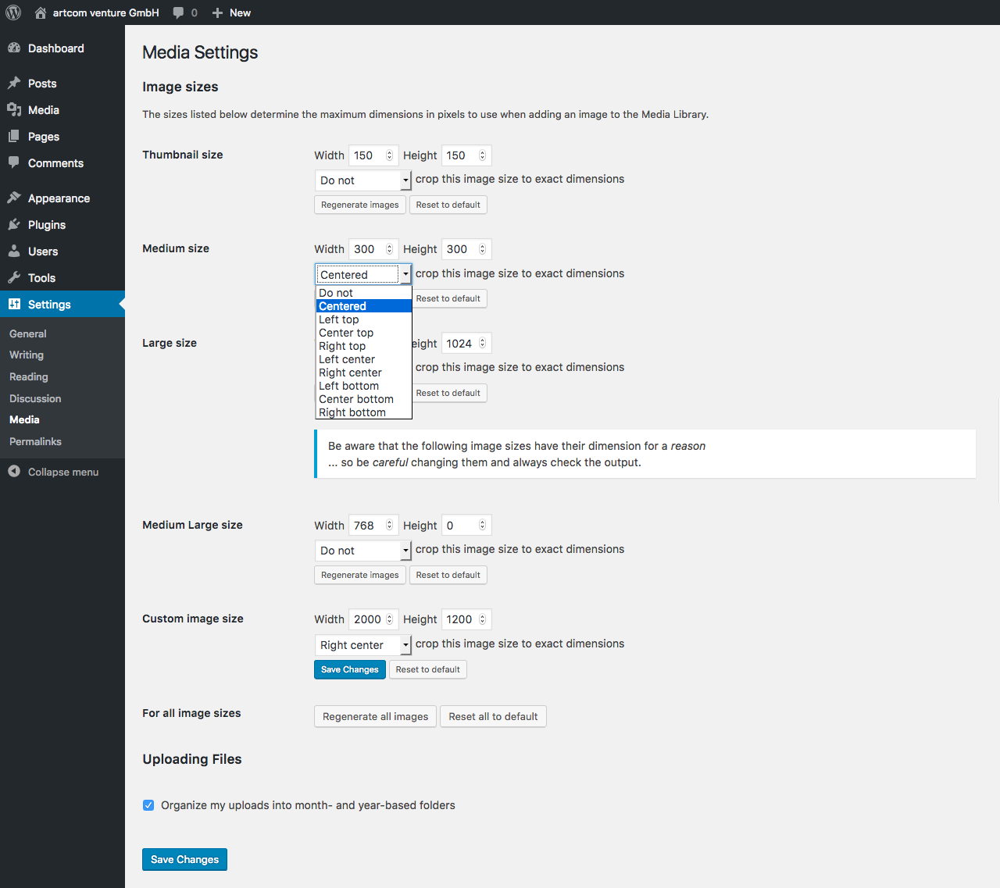

# WordPress Image Sizes

Get access (capability: manage_options) to all image sizes and edit their dimensions for your purpose.

You can also define whether to crop images to specified width and height or resize.

Last but not least: regenerate your images after changing any image size setting to apply these changes to already uploaded images.

## Installation

1. Upload files to the `/wp-content/plugins/` directory of your WordPress installation.
  * Either [download the latest files](https://github.com/artcomventure/wordpress-plugin-imageSizes/archive/master.zip) and extract zip (optionally rename folder)
  * ... or clone repository:
  ```
  $ cd /PATH/TO/WORDPRESS/wp-content/plugins/
  $ git clone https://github.com/artcomventure/wordpress-plugin-imageSizes.git
  ```
  If you want a different folder name than `wordpress-plugin-imageSizes` extend clone command by ` 'FOLDERNAME'` (replace the word `'FOLDERNAME'` by your chosen one):
  ```
  $ git clone https://github.com/artcomventure/wordpress-plugin-imageSizes.git 'FOLDERNAME'
  ```
2. Activate the plugin through the 'Plugins' screen in WordPress.
3. **Enjoy**

## Usage

You can find all _additional_ settings (sizes, cropping, reset, regenerate) on the 'Media' options page listed in the submenu of 'Settings'.



### Note

If you change any settings, you must regenerate the images to apply the changes **to already uploaded images**.

## Plugin Updates

Although the plugin is not _yet_ listed on https://wordpress.org/plugins/, you can use WordPress' update functionality to keep it in sync with the files from [GitHub](https://github.com/artcomventure/wordpress-plugin-imageSizes).

**Please use for this our [WordPress Repository Updater](https://github.com/artcomventure/wordpress-plugin-repoUpdater)** with the settings:

* Repository URL: https://github.com/artcomventure/wordpress-plugin-imageSizes/
* Subfolder (optionally, if you don't want/need the development files in your environment): build

_We test our plugin through its paces, but we advise you to take all safety precautions before the update. Just in case of the unexpected._

## Questions, concerns, needs, suggestions?

Don't hesitate! [Issues](https://github.com/artcomventure/wordpress-plugin-imageSizes/issues) welcome.
